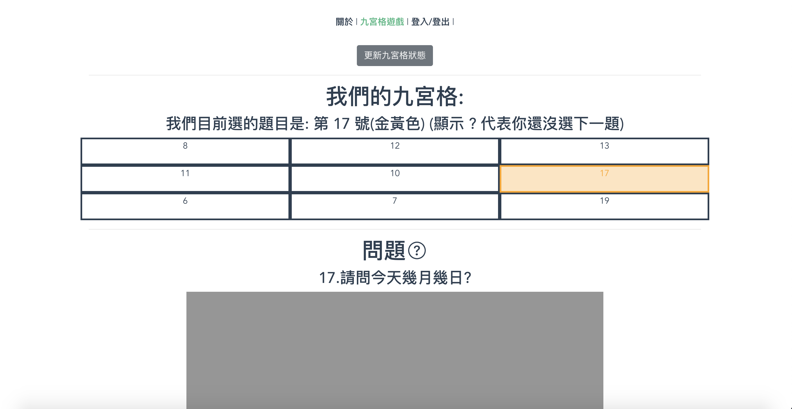
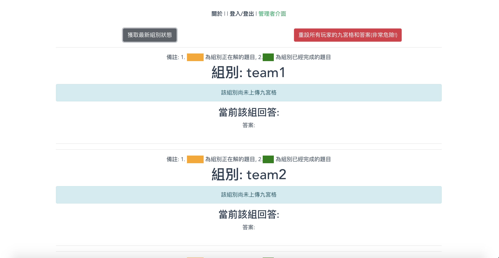

# WebNineGridGame

## Setup
* Compiled Vue (I build it by `@vue/cli 4.2.3`) by `npm run build` and move the compiled folder into `./dist`.
* Run your mongo db server at `mongodb://172.17.0.1:17990` (ex. `docker run --rm -p 172.17.0.1:17990:27017 mongo`)
* Setup the Golang docker image by: `docker build -t jimlin7777/webninegrid .`
* Run the Golang docker image by: `docker run -it --rm -p 17989:80 -v $(pwd):/root/WebNineGridGame jimlin7777/webninegrid bash`

## System Logical View
```
Vue (./game -> ./dist) <-> Golang (main.go) <-> MongoDB
```

## Demo

* About


* Login


* Login Success


* User Drag-and-drop Interative Interface


* User Question Selection


* User Question Answering


* Admin Management Page


* Admin Approval or Rejection Page


* Admin Teams' Status Page


* User Question Passed

